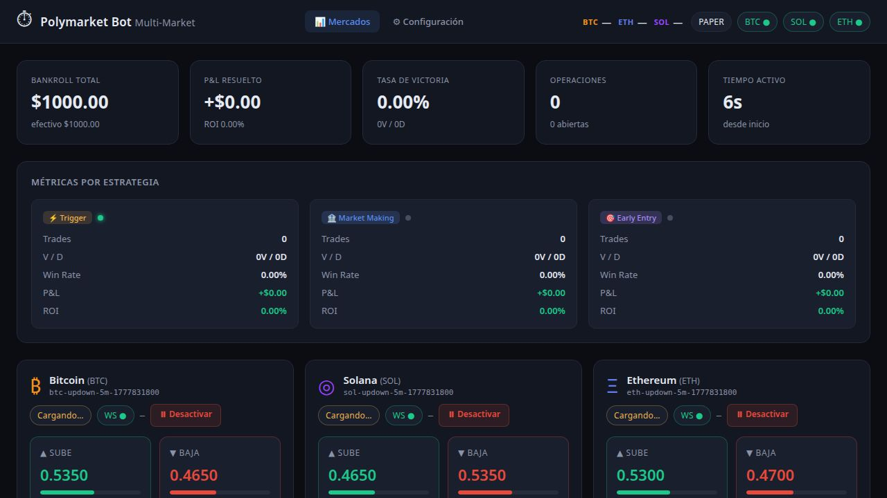

# Polymarket Multi-Market Bot (BTC / ETH / SOL)

Bot automatizado que opera los mercados de predicción **BTC, ETH y SOL up/down de 5 minutos** en [Polymarket](https://polymarket.com). Incluye un dashboard web en tiempo real con KPIs globales, métricas por estrategia, historial de operaciones y soporte para tres estrategias de trading independientes o combinadas.

---

## Screenshot



---

## Índice

1. [Cómo funciona](#cómo-funciona)
2. [Estrategias de trading](#estrategias-de-trading)
3. [Estructura del proyecto](#estructura-del-proyecto)
4. [Requisitos](#requisitos)
5. [Instalación local](#instalación-local)
6. [Instalación en Replit](#instalación-en-replit)
7. [Variables de entorno](#variables-de-entorno)
8. [Modos de operación](#modos-de-operación)
9. [Dashboard web](#dashboard-web)
10. [Pasar a modo real](#pasar-a-modo-real)
11. [Advertencias de riesgo](#advertencias-de-riesgo)

---

## Cómo funciona

Polymarket ofrece mercados de predicción binarios de 5 minutos sobre el precio de Bitcoin, Ethereum y Solana. Cada ventana tiene dos tokens:

- **UP** — paga $1 si el activo sube durante la ventana.
- **DOWN** — paga $1 si el activo baja durante la ventana.

El precio de cada token oscila entre $0 y $1 y refleja la probabilidad implícita del mercado. El bot monitorea estos precios en tiempo real a través del **WebSocket CLOBv2** de Polymarket y ejecuta órdenes cuando se cumplen condiciones específicas.

El bot lanza **tres traders en paralelo**, uno por cada mercado (BTC, SOL, ETH), cada uno con su propio feed de precios WebSocket, hilo de estrategia y estado aislado. La configuración es global y se aplica a los tres simultáneamente.

---

## Estrategias de trading

El bot soporta tres estrategias. Trigger y Market Making pueden activarse de forma independiente o simultánea. Early Entry es un flag adicional que puede activarse sobre cualquier otra estrategia.

---

### ⚡ Estrategia Trigger

Sigue estas reglas en orden estricto para cada ventana de 5 minutos:

#### 1. Cargar mercado
Al inicio de cada ventana, resuelve los token IDs de UP y DOWN para el slug actual (`btc-updown-5m-<timestamp>`) usando la API Gamma de Polymarket.

#### 2. Esperar el último minuto
El bot permanece inactivo hasta que queda `LAST_MINUTE_SECONDS` (por defecto 60 s) para que termine la ventana. Operar cerca del cierre reduce la exposición temporal.

#### 3. Verificar precio de entrada
Al entrar al último minuto, si **ambos** lados tienen precio disponible Y al menos uno ya cotiza por encima del `TRIGGER_PRICE`, la oportunidad se descarta (`SKIP`). Si solo hay datos de un lado (baja liquidez), el bot continúa para no perder ventanas legítimas.

#### 4. Ventana de entrada (primeros 45 s del último minuto)
Las nuevas posiciones solo se abren durante los **primeros 45 segundos** del último minuto. Pasado ese punto se cierra la ventana de entrada y el bot ya no abre operaciones nuevas en esa ventana.

#### 5. Disparo de orden
Cuando `precio >= TRIGGER_PRICE` para UP o DOWN dentro del período de entrada:
- Se compra al **precio de mercado observado** (no al trigger, que es solo señal de entrada).
- El monto invertido es `BUY_AMOUNT` USDC.
- Máximo `MAX_TRADES_PER_WINDOW` operaciones iniciales por ventana.

#### 6. Cobertura (hedge)
Mientras se mantiene la posición, si el precio del lado comprado sube hasta `HEDGE_THRESHOLD` (por defecto 0.96), se compra el lado contrario con la misma cantidad de shares, bloqueando ganancia en cualquier resultado.

#### 7. Semi-cobertura de emergencia (últimos 10 s → se ejecuta a los 5 s)
Si al llegar a los últimos **10 segundos** la posición sigue abierta y no se colocó hedge, el bot espera hasta que queden **5 segundos** y entonces compra el **50% de los shares iniciales** en el lado contrario. Esto mitiga la pérdida máxima sin comprometer el 100% del capital de cobertura.

#### 8. Settlement
Al cierre de la ventana, las posiciones abiertas se resuelven según el precio final:
- Si el lado comprado gana (`precio ≥ 0.99`), paya $1 por share → ganancia.
- Si pierde (`precio ≤ 0.05`), el token vale $0 → pérdida del costo.

---

### 🏦 Estrategia Market Making

Se activa en los últimos `MM_LAST_SECONDS` segundos de cada ventana y compra **ambos lados simultáneamente** con una cantidad fija de shares.

#### Lógica
1. El bot espera hasta que el reloj de la ventana llega a `MM_LAST_SECONDS` antes del cierre.
2. Lee el precio de UP y DOWN **en tiempo real** justo antes de colocar cada orden.
3. Si el precio de un lado supera `MM_MAX_PRICE`, ese lado se omite.
4. Si el precio es aceptable, compra exactamente `MM_SHARES` shares en ese lado.
5. Al settlement, el lado ganador paga $1/share y el perdedor vale $0.

#### Parámetros

| Parámetro | Por defecto | Descripción |
|---|---|---|
| `MM_SHARES` | `20` | Shares a comprar por cada lado |
| `MM_LAST_SECONDS` | `30` | Segundos antes del cierre en que se activa |
| `MM_MAX_PRICE` | `0.95` | Precio máximo de entrada; si se supera se omite ese lado |

---

### 🎯 Estrategia Early Entry

Estrategia de entrada temprana con cobertura condicional. Se activa mediante un toggle independiente desde la página de Configuración.

#### Lógica
1. A los **40 segundos del inicio** de cada ventana, identifica el **lado dominante** (el que tiene precio más alto en ese momento).
2. Abre una posición con el **25% de los shares configurados** en `MM_SHARES`.
3. Inicia un monitor continuo hasta el cierre de la ventana que comprueba dos condiciones en cada tick (cada 250ms):
   - **Take-profit (+3%)**: si el precio del lado comprado sube ≥ 3% desde el precio de entrada → se vende la posición automáticamente con ganancia. Una vez ejecutado el TP, **no se abre cobertura**.
   - **Cobertura condicional**: si la posición sigue abierta (no se activó TP) Y la suma `UP + DOWN ≤ 0.97` → se abre una posición en el lado contrario con la **misma cantidad de shares**. La condición `UP + DOWN ≤ 0.97` indica una oportunidad de mercado donde cubrir ambos lados es favorable.

#### Parámetros

| Campo | Valor | Descripción |
|---|---|---|
| Shares de entrada | 25% de `MM_SHARES` | Compra fraccional para entrada temprana |
| Take-profit | +3% desde entrada | Venta automática al alcanzar ganancia del 3% |
| Cobertura | UP + DOWN ≤ 0.97 | Condición de precio para abrir el lado contrario |
| Shares de cobertura | Igual que la entrada | Cobertura simétrica 1:1 |

---

### Selección de estrategia

Desde la página de Configuración puedes elegir:
- **⚡ Trigger** — solo estrategia trigger.
- **🏦 Market Making** — solo estrategia market making.
- **⚡+🏦 Ambas** — ambas estrategias corren en paralelo en cada ventana.
- **🎯 Early Entry** — toggle independiente que puede activarse sobre cualquiera de las anteriores.

---

## Control por mercado

Cada mercado (BTC, SOL, ETH) puede **activarse o desactivarse individualmente** desde el panel de mercados del dashboard mediante los botones "⏸ Desactivar" / "▶ Activar". Un mercado desactivado no abre nuevas ventanas de trading hasta volver a activarse.

---

## Métricas por estrategia

El dashboard muestra en tiempo real métricas separadas para cada estrategia activa:

| Métrica | Descripción |
|---|---|
| Trades | Operaciones totales ejecutadas |
| V / D | Victorias y derrotas |
| Win Rate | Porcentaje de operaciones ganadoras |
| P&L | Beneficio/pérdida neto resuelto |
| ROI | Retorno sobre el capital invertido |

---

## Estructura del proyecto

```
polymarket-bot/
│
├── bot/
│   ├── __init__.py
│   ├── main.py           # Punto de entrada: lanza traders (BTC/ETH/SOL) + dashboard
│   ├── config.py         # Configuración desde variables de entorno
│   ├── state.py          # Estado compartido thread-safe por mercado (BotState × 3)
│   ├── logger.py         # Logger con buffer circular y niveles de color
│   ├── market.py         # Carga mercado activo desde Gamma API
│   ├── price_feed.py     # WebSocket CLOBv2 (book + last_trade_price + user)
│   ├── trader.py         # Loop principal: trigger → early-entry → hedge → settlement
│   ├── strategy_mm.py    # Estrategia Market Making (ambos lados al cierre)
│   ├── dashboard.py      # Servidor Flask: UI + /state + /config + /toggle-market
│   ├── templates/
│   │   ├── dashboard.html   # Dashboard principal multi-mercado
│   │   └── settings.html    # Configuración global del bot
│   └── static/
│       ├── dashboard.css
│       └── dashboard.js
│
├── run.py                # Entrada: python run.py
├── requirements.txt
├── .env.example          # Plantilla de variables de entorno
└── README.md
```

---

## Requisitos

- Python 3.11+

Dependencias principales (ver `requirements.txt`):

```
flask
flask-cors
requests
websocket-client
py-clob-client
eth-account
```

---

## Instalación local

```bash
# 1. Clonar el repositorio
git clone <url-del-repo>
cd polymarket-bot

# 2. Crear entorno virtual (recomendado)
python -m venv .venv
source .venv/bin/activate      # Linux / macOS
.venv\Scripts\activate         # Windows

# 3. Instalar dependencias
pip install -r requirements.txt

# 4. Configurar variables de entorno
cp .env.example .env
# Editar .env con tus valores

# 5. Iniciar el bot
python run.py
```

El dashboard queda disponible en `http://localhost:5000`.

---

## Instalación en Replit

1. Importar o clonar el proyecto en Replit.
2. Replit instala las dependencias automáticamente al detectar `requirements.txt`.
3. Agregar los secretos necesarios en **Tools → Secrets**:
   - `PRIVATE_KEY` y `PROXY_WALLET` solo si usas modo real.
   - El resto de variables opcionales según necesidad.
4. Ejecutar el workflow **Start application** (`python run.py`).
5. La UI se muestra en el panel de preview en el puerto 5000.

---

## Variables de entorno

### Generales

| Variable | Por defecto | Descripción |
|---|---|---|
| `TRADING_MODE` | `paper` | `paper` (simulación) o `real` (fondos reales) |
| `STARTING_BANKROLL` | `1000.0` | Bankroll inicial para cálculo de P&L |
| `PORT` | `5000` | Puerto del dashboard web |
| `DASHBOARD_HOST` | `0.0.0.0` | Host de escucha del dashboard |

### ⚡ Estrategia Trigger

| Variable | Por defecto | Descripción |
|---|---|---|
| `TRIGGER_PRICE` | `0.90` | Precio de cruce para abrir posición (0.01–0.99) |
| `BUY_AMOUNT` | `5.0` | USDC a invertir por operación |
| `MAX_TRADES_PER_WINDOW` | `1` | Máximo de posiciones iniciales por ventana (1–10) |
| `HEDGE_THRESHOLD` | `0.96` | Precio al que se activa la cobertura del lado contrario (0.50–0.99) |
| `LAST_MINUTE_SECONDS` | `60` | Segundos antes del cierre en los que se activa la vigilancia (10–240) |

### 🏦 Estrategia Market Making

| Variable | Por defecto | Descripción |
|---|---|---|
| `MM_SHARES` | `20` | Shares a comprar por cada lado en la estrategia MM y Early Entry |
| `MM_LAST_SECONDS` | `30` | Segundos antes del cierre en que se activa el MM (5–120) |
| `MM_MAX_PRICE` | `0.95` | Precio máximo de entrada MM; si se supera se omite ese lado (0.50–0.99) |

### Infraestructura

| Variable | Por defecto | Descripción |
|---|---|---|
| `PRIVATE_KEY` | — | Clave privada de la wallet Polygon (**solo modo real**) |
| `PROXY_WALLET` | — | Dirección del proxy wallet de Polymarket (**solo modo real**) |
| `CHAIN_ID` | `137` | Chain ID de Polygon |
| `SIGNATURE_TYPE` | `2` | Tipo de firma Polymarket (2 = proxy wallet) |
| `CLOB_HOST` | `https://clob.polymarket.com` | Endpoint REST del CLOB |
| `GAMMA_HOST` | `https://gamma-api.polymarket.com` | Endpoint de la Gamma API |
| `CLOB_WS_URL` | `wss://ws-subscriptions-clob.polymarket.com/ws/market` | WebSocket CLOBv2 de mercado |
| `POLL_INTERVAL_MS` | `50` | Intervalo de polling del loop de trading (ms) |
| `MARKET_RETRY_SECONDS` | `3` | Segundos entre reintentos al cargar el mercado |
| `FIRST_PRICE_TIMEOUT` | `5` | Segundos de espera para recibir el primer precio |

---

## WebSocket CLOBv2

El bot utiliza el **WebSocket CLOBv2** de Polymarket con suscripción al canal de mercado:

```
wss://ws-subscriptions-clob.polymarket.com/ws/market
```

Mensaje de suscripción:
```json
{
  "auth": null,
  "markets": [],
  "assets_ids": ["<up_token_id>", "<down_token_id>"],
  "type": "market"
}
```

Tipos de evento manejados:

| Evento | Descripción |
|---|---|
| `book` | Snapshot completo del libro de órdenes; calcula mid = (best_bid + best_ask) / 2 |
| `last_trade_price` | Precio del último trade ejecutado; señal de precio más actualizada |
| `price_change` | Actualización incremental del libro; recalcula mid desde best_bid / best_ask |
| `best_bid_ask` | Snapshot directo de mejor compra/venta |

El bot mantiene una caché de bid/ask por token y emite el precio mid cada vez que recibe cualquier evento. Auto-reconecta cada 3 segundos ante desconexiones.

---

## Modos de operación

### Paper (simulación)
Por defecto. No se envía ninguna orden real a Polymarket. Las compras se simulan con los precios de mercado en tiempo real. El P&L se calcula igual que en modo real. Ideal para validar la estrategia sin riesgo.

### Real
Requiere `PRIVATE_KEY` y `PROXY_WALLET`. Las órdenes se envían al CLOB de Polymarket como órdenes GTC (Good-Till-Cancelled). Usa fondos reales de tu wallet de Polygon.

Puedes cambiar entre modos desde la página de Configuración en tiempo real sin reiniciar el bot.

---

## Dashboard web

Disponible en `http://localhost:5000` (o el puerto configurado).

### Página principal (`/`)

| Sección | Descripción |
|---|---|
| **Header** | Precio spot BTC/ETH/SOL en tiempo real, modo actual, estado WebSocket por mercado |
| **KPIs globales** | Bankroll total, P&L resuelto, win rate, operaciones totales, tiempo activo |
| **Métricas por estrategia** | Tabla de Trigger / Market Making / Early Entry con trades, V/D, win rate, P&L y ROI |
| **Paneles de mercado** | BTC, SOL y ETH con precio UP/DOWN en tiempo real, estado del bot y botón activar/desactivar |
| **Tabla de operaciones** | Todas las operaciones de todos los mercados con columna de estrategia (TRG/MM/EE) |
| **Log de actividad** | Registro de eventos del bot con niveles, timestamps y etiqueta de mercado |

### Página de configuración (`/settings`)

| Sección | Descripción |
|---|---|
| **Estrategia activa** | Selector Trigger / Market Making / Ambas |
| **Trigger** | Precio trigger, monto por trade, trades por ventana, hedge threshold, segundos de entrada |
| **Semi-cobertura final** | Informativo: se ejecuta automáticamente a los 5s restantes cuando no hay hedge |
| **Market Making** | Shares por lado, segundos antes del cierre, precio máximo de entrada |
| **Early Entry (Kelly)** | Toggle de activación, preview de shares calculados |
| **General** | Bankroll inicial, selector de modo paper/real |
| **Estado para modo Real** | Checklist de readiness con pasos pendientes para activar el modo real |

### Endpoints API

| Ruta | Método | Descripción |
|---|---|---|
| `/` | GET | Dashboard HTML principal |
| `/settings` | GET | Página de configuración |
| `/state` | GET | Snapshot JSON completo del estado de todos los mercados |
| `/config` | POST | Actualizar configuración en tiempo real |
| `/toggle-market/<sym>` | POST | Activar / desactivar un mercado (btc, eth, sol) |
| `/healthz` | GET | Health check (`{"ok": true}`) |

---

## Pasar a modo real

1. Crear una cuenta en [Polymarket](https://polymarket.com) y depositar USDC en Polygon.
2. Obtener tu `PRIVATE_KEY` de la wallet de Polygon que usas en Polymarket.
3. Obtener la dirección del `PROXY_WALLET` de Polymarket.
4. Configurar las variables de entorno en Replit **Tools → Secrets**:
   ```
   TRADING_MODE=real
   PRIVATE_KEY=0x...
   PROXY_WALLET=0x...
   ```
5. Reiniciar el bot.
6. El dashboard mostrará un checklist de readiness antes de permitir el modo real.

---

## Advertencias de riesgo

- **Los mercados de predicción son instrumentos especulativos de alto riesgo.** Puedes perder la totalidad del capital invertido.
- El modo paper no garantiza los mismos resultados en modo real (slippage, liquidez, latencia).
- Nunca compartas ni subas a un repositorio público tu `PRIVATE_KEY`.
- Empieza siempre con montos pequeños para validar el comportamiento en producción.
- Este software se provee tal cual, sin garantía de ningún tipo.
